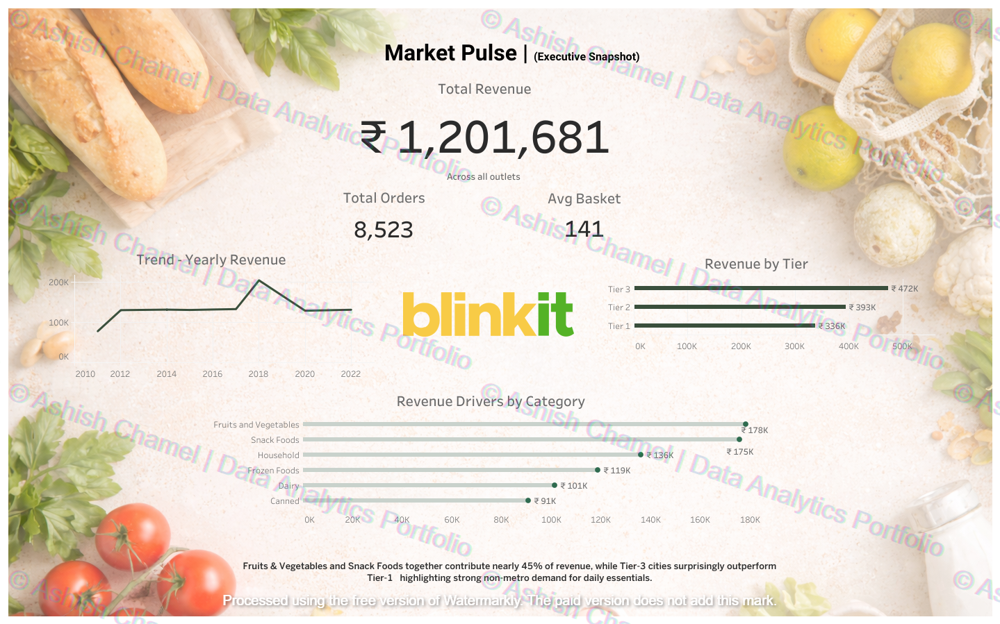
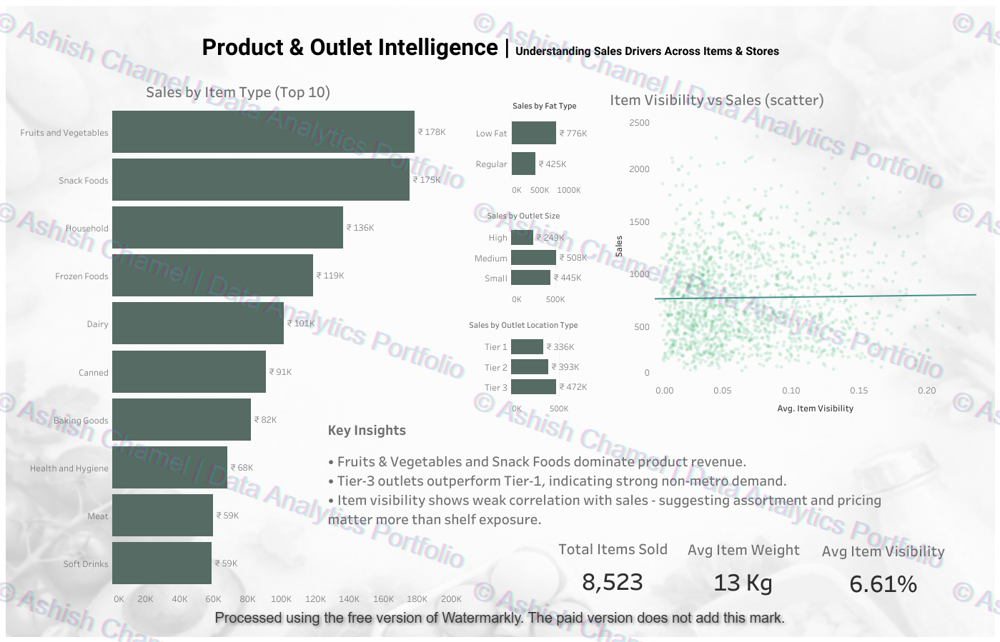
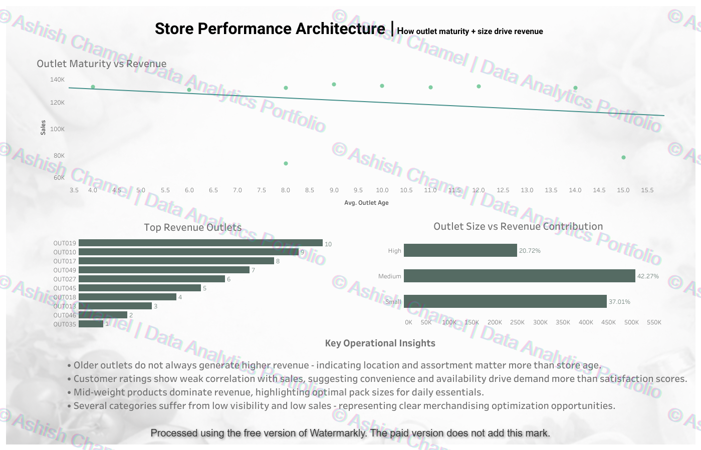

# Retail Performance Intelligence  
## Blinkit Sales & Store Analytics  
Business Intelligence Case Study

---

## Executive Summary

This project analyzes grocery retail sales data to identify revenue drivers across product categories, outlet tiers, and store formats.  

The objective was to simulate a real-world Business Intelligence engagement — transforming raw transactional data into structured insights that support operational optimization and expansion strategy.

The outcome is a three-layer analytical narrative:
1. Market Performance Overview  
2. Product & Outlet Drivers  
3. Store Architecture & Revenue Concentration  

Together, these dashboards translate raw data into strategic direction.

---

## Business Problem

Retail organizations must continuously evaluate:

- Which store formats generate optimal revenue?
- Do older outlets outperform newer ones?
- Which product categories drive sustainable growth?
- Does product visibility meaningfully impact sales?
- Where should expansion efforts be focused?

This case study answers these questions using structured analysis and executive dashboarding.

---

## Methodology

### 1. Data Preprocessing (Python)

All preprocessing was performed using Pandas.

Key transformations:

- Standardized column naming conventions
- Imputed missing `item_weight` values using median
- Replaced zero `item_visibility` values to prevent analytical distortion
- Normalized inconsistent categorical values in `item_fat_content`
- Engineered `outlet_age` feature from establishment year
- Removed duplicate records

File:
`preprocessing/blinkit_data_preprocessing.py`

These steps ensured analytical reliability prior to visualization.

---

### 2. Analytical Workflow

Raw Data  
→ Data Cleaning  
→ Feature Engineering  
→ Dashboard Construction (Tableau)  
→ Insight Translation  

---

## Dashboard Architecture

### I. Market Pulse — Executive Overview

Purpose:  
Provide a high-level snapshot of revenue performance and category contribution.

Key Components:
- Total Revenue
- Total Orders
- Average Basket Value
- Revenue by Outlet Tier
- Revenue by Category
- Revenue Trend

Core Insight:
Tier-3 outlets outperform Tier-1 locations, highlighting strong non-metro demand for daily essentials.

---

### II. Product & Outlet Intelligence

Purpose:  
Identify operational sales drivers across products and formats.

Key Analysis:
- Sales by Item Type
- Sales by Fat Content
- Sales by Outlet Size
- Sales by Location Tier
- Item Visibility vs Sales (Correlation)

Core Insight:
Item visibility shows weak correlation with revenue, suggesting assortment strategy and pricing drive performance more than shelf exposure.

---

### III. Store Performance Architecture

Purpose:  
Evaluate outlet maturity and structural revenue distribution.

Key Analysis:
- Outlet Age vs Revenue
- Revenue Contribution by Outlet Size
- Top Revenue-Generating Outlets

Core Insight:
Medium-sized outlets deliver the highest revenue contribution.
Outlet age has weak correlation with performance, emphasizing location quality over longevity.

Revenue concentration suggests replicable high-performing store models.

---

## Strategic Findings

- Daily essential categories drive the majority of revenue.
- Tier-3 locations represent strong growth potential.
- Medium-sized outlets balance operational efficiency and profitability.
- Product visibility alone does not guarantee sales performance.
- Revenue concentration enables scalable replication strategies.

---

## Repository Structure
```
Blinkit-Retail-Analytics/
│
├── dashboards/
│   ├── 01_market_pulse.png
│   ├── 02_product_outlet_intelligence.png
│   └── 03_store_performance_architecture.png
│
├── preprocessing/
│   └── blinkit_data_preprocessing.py
│
└── README.md
```
---

## Dashboard Snapshots

### Market Pulse


### Product & Outlet Intelligence


### Store Performance Architecture


---

## Skills Demonstrated

- Data Cleaning and Transformation (Pandas)
- Feature Engineering
- Retail Revenue Analysis
- Correlation Assessment
- Executive Dashboard Design (Tableau)
- Strategic Insight Communication

---

## Disclaimer

Dataset is publicly available / simulated for educational and portfolio purposes.  
Dashboards are shared as static snapshots.

---

## Author

Ashish Chamel  
Business Intelligence & Data Analytics
